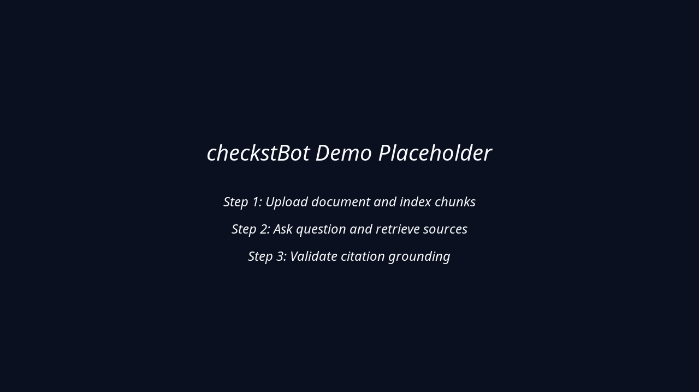

# checkstBot

[](https://opensource.org/licenses/MIT)
[](https://nodejs.org/)
[](https://www.typescriptlang.org/)
[](https://nextjs.org/)
[](#testing)

A production-ready RAG-powered learning assistant that combines document processing with conversational AI to help students and researchers interact with their materials more effectively.

## Demo + Outcome



- End-to-end workflow: upload document -> ask question -> inspect grounded response.
- Evaluation artifact available at [docs/evaluation.md](docs/evaluation.md).
- Release notes draft available at [docs/releases/v1.0.0.md](docs/releases/v1.0.0.md).

## Features

- **Smart Document Processing**: Upload and process PDFs, DOCX, TXT, and Markdown files
- **RAG System**: Retrieval-Augmented Generation with configurable relevance thresholds
- **Semantic Search**: OpenAI embeddings with Pinecone vector database
- **Text Selection**: Highlight text for contextual explanations
- **Chat Persistence**: Document-scoped conversation history with offline support
- **Production Security**: CSRF protection, rate limiting, security headers

## Quick Start

### Prerequisites

- Node.js 20+
- OpenAI API key
- Pinecone API key and index

### Installation

```bash
# Clone the repository
git clone https://github.com/codeme-ne/checkstBot.git
cd checkstBot

# Install dependencies
npm install

# Set up environment variables
cp .env.example .env.local
# Edit .env.local with your API keys

# Run the development server
npm run dev
```

Open [http://localhost:3000](http://localhost:3000) in your browser.

## Configuration

### Environment Variables

```env
OPENAI_API_KEY=sk-your-openai-key-here
PINECONE_API_KEY=your-pinecone-key-here
PINECONE_INDEX=your-pinecone-index-name
```

See [`.env.example`](.env.example) for all available options.

## Architecture

### Tech Stack

| Layer | Technology |
|-------|------------|
| Framework | Next.js 14 (Pages Router) |
| Language | TypeScript (strict mode) |
| Styling | Tailwind CSS |
| Embeddings | OpenAI text-embedding-ada-002 |
| Vector DB | Pinecone |
| LLM | OpenAI GPT-4 |

### Project Structure

```
checkstBot/
├── components/           # React components (11 specialized)
│   ├── ChatInterface.tsx       # Chat UI with persistence
│   ├── EnhancedDocumentViewer.tsx  # Smart document factory
│   ├── PDFViewer.tsx           # PDF rendering
│   ├── MarkdownViewer.tsx      # Markdown display
│   ├── TextViewer.tsx          # Plain text display
│   ├── MessageBubble.tsx       # Chat message rendering
│   ├── FileUpload.tsx          # Drag-and-drop upload
│   ├── SelectionTooltip.tsx    # Text selection actions
│   └── ...
├── lib/                  # Core services
│   ├── rag.ts                  # RAG pipeline orchestration
│   ├── embedding.ts            # OpenAI embeddings
│   ├── vector-db.ts            # Pinecone operations
│   ├── document-parser.ts      # File parsing
│   ├── csrf.ts                 # CSRF protection
│   └── rate-limit.ts           # Request throttling
├── pages/                # Next.js pages (Pages Router)
│   ├── api/
│   │   ├── upload.ts           # Document upload endpoint
│   │   ├── chat.ts             # Chat completion endpoint
│   │   └── csrf.ts             # CSRF token endpoint
│   └── index.tsx               # Main application
├── __tests__/            # Test suite (53 tests)
└── styles/               # Tailwind styles
```

### RAG Pipeline

```
┌─────────────┐    ┌─────────────┐    ┌─────────────┐
│   Upload    │───>│   Parse &   │───>│  Generate   │
│  Document   │    │   Chunk     │    │ Embeddings  │
└─────────────┘    └─────────────┘    └─────────────┘
                                             │
                                             v
┌─────────────┐    ┌─────────────┐    ┌─────────────┐
│   Return    │<───│   LLM with  │<───│   Store in  │
│  Response   │    │   Context   │    │  Pinecone   │
└─────────────┘    └─────────────┘    └─────────────┘
                          ^
                          │
┌─────────────┐    ┌─────────────┐
│    User     │───>│  Semantic   │
│   Query     │    │   Search    │
└─────────────┘    └─────────────┘
```

## Development

### Available Scripts

```bash
npm run dev          # Start development server
npm run build        # Build for production
npm run start        # Start production server
npm run lint         # Run ESLint
npm run type-check   # Run TypeScript checks
npm run test         # Run test suite
npm run test -- --watch  # TDD mode
```

### Testing

This project follows **Test-Driven Development (TDD)**. See [CONTRIBUTING.md](CONTRIBUTING.md) for the TDD workflow.

```bash
# Run all tests
npm run test

# Run with coverage
npm run test -- --coverage

# Watch mode for TDD
npm run test -- --watch
```

## Security

See [SECURITY.md](SECURITY.md) for:
- Vulnerability reporting process
- Security features implemented
- AI/RAG-specific security considerations
- Best practices for deployers

## Deployment

### Vercel (Recommended)

1. Push to GitHub
2. Connect to Vercel
3. Add environment variables in Vercel dashboard
4. Deploy

### Pre-deployment Validation

```bash
node scripts/pre-deploy-check.js
```

## Contributing

We welcome contributions! Please see [CONTRIBUTING.md](CONTRIBUTING.md) for:
- Development setup
- TDD workflow
- Pull request guidelines
- Code style requirements

## License

[MIT](LICENSE) - see the [LICENSE](LICENSE) file for details.

## Links

- [OpenAI API Documentation](https://platform.openai.com/docs)
- [Pinecone Documentation](https://docs.pinecone.io/)
- [Next.js Documentation](https://nextjs.org/docs)
- [Evaluation Snapshot](docs/evaluation.md)
- [Release Notes v1.0.0](docs/releases/v1.0.0.md)

## Support

- [Report a Bug](.github/ISSUE_TEMPLATE/bug_report.md)
- [Request a Feature](.github/ISSUE_TEMPLATE/feature_request.md)
- [Security Issues](SECURITY.md)

---

Built for enhanced learning and research.
